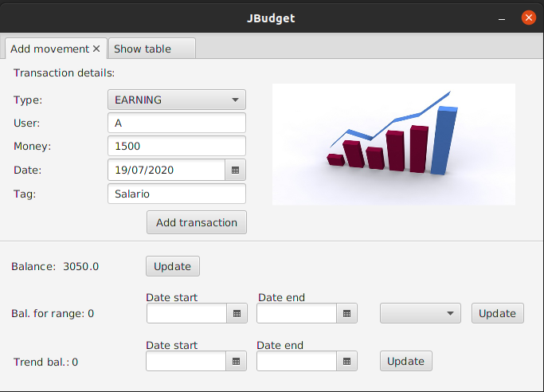
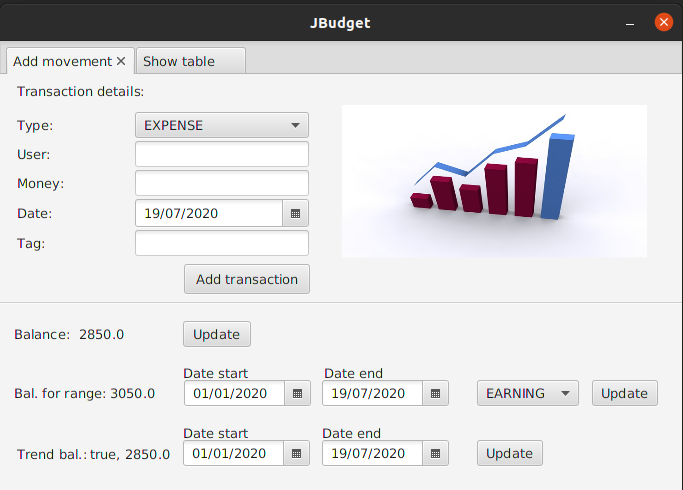

# JBudget

Presentazione del progetto.
Progetto che ha lo scopo di tenere conto della gestione di un budget familiare, con la possibilità di aggiungere movimenti, vedere il bilancio attuale, il bilancio dato dalle (entrate/uscite) per un dato range di tempo.

Vi è la possibilità di vedere l'andamento per un dato range, per vedere se si è in positivo o negativo dato dalla somma di tutte le transazioni effettuate.

Possiamo osservare le tabelle delle relative entrate/uscite.

Possibilità di vedere le tabelle dei tag a cui ad ognuno è associato la somma degli introiti.

