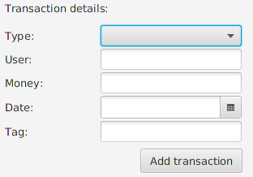
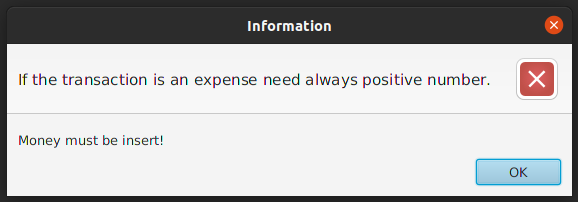
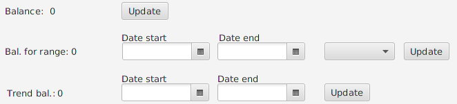
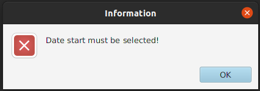
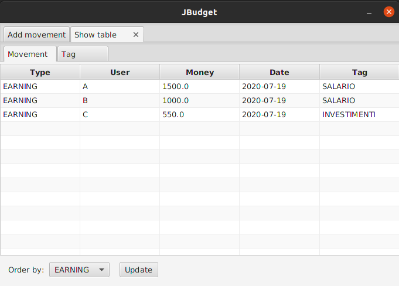
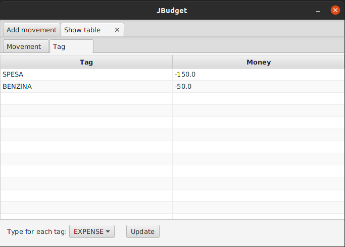

## JBudget

JBudget è un software realizzato seguendo il pattern MVC, che ha lo scopo di tenere conto della gestione di un budget familiare.
Mette a disposizione sia la modalità GUI che quella Console.

Questa applicazione offre la possibilià di svolgere operazioni quali:

`1. Aggiungere una transazione.`



```
Nota: assicurarsi di inserire un'importo numerico (es. 100.50, 510.15), altrimenti si riscontra il seguente errore.
```



---
---

```
2. Vedere il bilancio dopo aver aggiunto una transazione.
3. Vedere il bilancio dato dalla somma delle sole entrate o uscite per un dato range di tempo.
4. Vedere l'andamento del bilancio in un dato range riportandone lo stato.
```


```
Nota: nel caso la data di inizio del range non sia presente si riscontra un errore di questo tipo.
```



---
---

`5. È possibile osservare la tabella delle entrate/uscite data dalle transazioni aggiunte.`



---
---

`6. È possibile osservare la tabella delle entrate/uscite dei tag, data dalla somma di ognuno di essi.`


